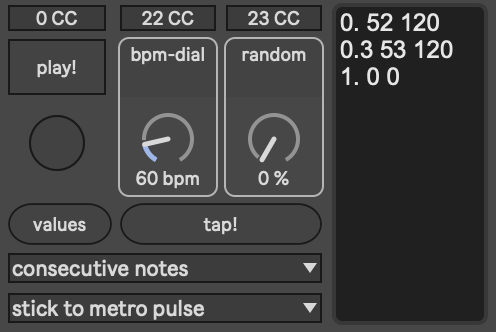

# tesser_repeat

*A Max for Live device for organic rhythmic repetition — simulating pulse, heartbeat, and temporal fluctuation.*

---

## Overview

**tesser_repeat** is a Max for Live device that generates and manipulates repeated MIDI events, designed to emulate rhythmic regularity and its subtle deviations — much like a living heartbeat.

Developed as part of the **TesserAkt** ecosystem of devices, it allows for precise yet expressive control of repetition rate and randomness, functioning both as a musical and conceptual tool for exploring microtemporal variation in performance.

Originally developed for the live piece
***[Encounter with the Mountain](https://www.facebook.com/permalink.php?story_fbid=469919558520235&id=110241037821424)*** by **Alfredo Ledesma**, performed at the SOHO Studios in Vienna in 2022, the device was employed to simulate an evolving heartbeat, reflecting the organic instability of human rhythm.

---

## Features

* 💓 **BPM (Beats per Minute)**
  Controls the base pulse frequency. This parameter can be adjusted manually or automated live.

* 🎲 **Randomness (%)**
  Determines the degree of temporal deviation from the set BPM.
  
  * `0%` → perfectly regular pulse (mechanical).
  * `>0%` → introduces micro-irregularities resembling biological or emotional fluctuations.

* 🎧 **Standalone or Embedded Use**
  Can run as a **standalone Max patch** or be loaded as a **Max for Live device** within Ableton Live.

* 🧩 **Integration within [TesserAkt Ecosystem](https://github.com/AdrianArtacho/TesserAkt)**
  Designed for interoperability with other *TesserAkt* devices, sharing a philosophy of modular, time-based control for generative and performative systems.

---

## Use Cases

* Generating heartbeat-like rhythmic structures.
* Adding subtle humanization to sequenced patterns.
* Exploring temporal instability and micro-rhythmic variation in electroacoustic contexts.
* Integrating organic temporal layers into live electronic or multimedia performances.

---

## Requirements

* **Max 8** or later
* **Ableton Live Suite** (for M4L integration)

---

## Installation

1. Clone or download this repository.
2. Run patch.

In case you wanna use it inside Ableton Live:

1. Export patch as *Max For Live* device.
2. Open `tesser_repeat.amxd` in **Max** or **Ableton Live**.
3. Connect a MIDI output or instrument device.
4. Adjust **BPM** and **Randomness** parameters to explore different rhythmic textures.

---

## Artistic Context

> “In *Encounter with the Mountain*, the heartbeat becomes both a sonic and symbolic gesture —
> a pulse that bridges the mechanical and the organic.”
> — *Adrián Artacho (developer)*

---

## Acknowledgments

* Developed by **Adrián Artacho** as part of the [*TesserAkt*](https://github.com/AdrianArtacho/TesserAkt) project
* Supported by ongoing artistic research in embodied and temporal music systems